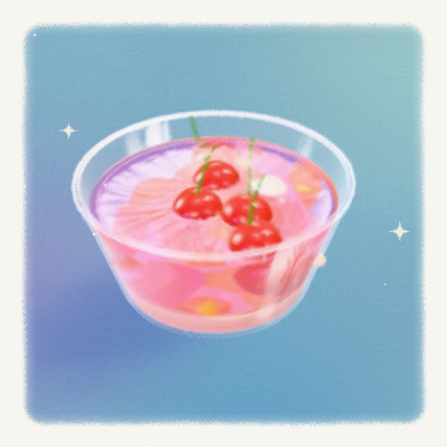
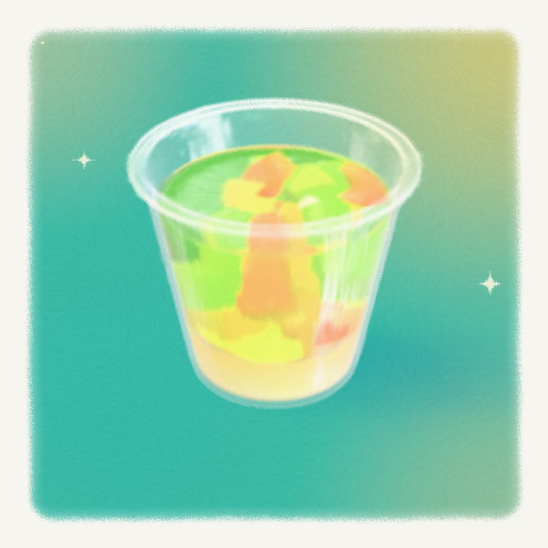
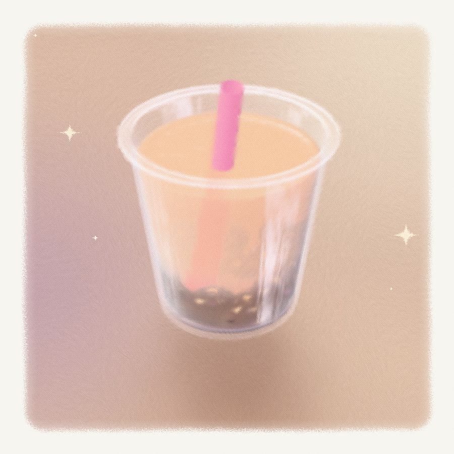

# Jelly Painting

A painted dessert cup with a wobbling jelly, rendered live in the browser with three.js (WebGPU + TSL). Drag the cup and the jelly sloshes, the fruit inside bobs and turns, and the whole thing is redrawn as brush strokes on paper every frame.

**Live:** https://jelly-painting.pages.dev/

<p>
  
  
  
</p>

## Credit

This is a fan re-creation of **[Jelly Painting](https://mesq.me/jelly-painting/) by Mesq ([@mesqme](https://x.com/mesqme))**. The idea, the look, and the colour palettes (sampled from screenshots of the original) are theirs; go see the original first.

The code here is written from scratch. None of the original's code, models or textures are used: the cups, fruit, painted normal maps and loading sketch are all generated in code.

## Try it

| | |
| --- | --- |
| Drag the cup | slide it across the table; the jelly lags, jiggles and settles |
| `S` | shake it |
| Arrow keys | nudge it |
| Drag elsewhere | orbit the view; scroll or pinch to zoom |
| Swatches | switch theme: Cherry, Kiwi, Boba |
| **Model** tab | put any `.glb` on the painted stage (drag a file in, or pick a preset: pudding, doughnut, macaron, teapot) and wobble that instead |

Links: `?theme=cherry|kiwi|boba`, `?mode=model&palette=lilac|peach|butter|seaglass|night|…`

Needs a browser with WebGPU (a recent Chrome, Edge or Safari).

## How it works

- **Jelly** – a soft body. A small lattice of nodes fills the cup; nodes touching the glass and the bottom are glued, the rest follow linear elasticity, pushed by the cup's acceleration and velocity. Each frame the displacement field is uploaded as a 3D texture that the jelly and cream vertex shaders read. Every piece of fruit samples the field at its own centre for its offset and local rotation, so they move independently. (`src/jelly.js`)
- **Cup motion** – a critically damped spring follows the pointer, with a slight lean into acceleration. (`src/sim.js`)
- **Painting** – post-processing in TSL: a structure tensor of the rendered image gives a stroke direction at every pixel, the colour is smeared along that flow with bristle ribs and scatter, then paper grain and a deckled frame are composited on top. Strokes are only computed inside the frame. (`src/post.js`)
- **Everything else is procedural** – lathed cups, diced fruit chunks, hand-painted normal maps drawn on a canvas (`src/paint.js`), backdrop gradients, the crayon cursor, and a loading screen that sketches the cup stroke by stroke before the real painting is brushed over it (`src/loader.js`).

| File | |
| --- | --- |
| `src/main.js` | the app: Jelly / Model modes, swatches, URL state |
| `src/stage.js` | renderer, backdrop, table, lights, drag and orbit, loading reveal |
| `src/scene.js` | cup, jelly, cream, fruit, table and shadow |
| `src/jelly.js` | jelly soft body |
| `src/sim.js` | cup motion |
| `src/post.js` | painterly post-processing and paper frame |
| `src/model.js`, `src/presets.js` | model mode and its preset models |
| `src/themes.js` | cup themes and backdrop palettes |

## Run locally

```sh
npm install
npm run dev     # http://localhost:5190
npm run build   # static site in dist/
```
